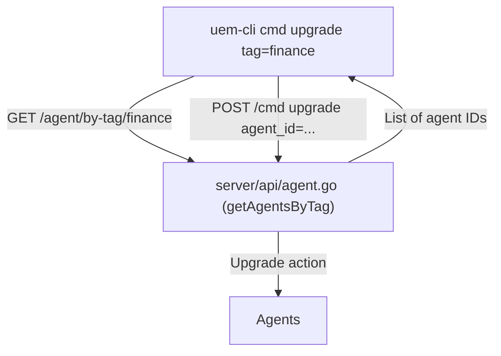

# Implementation Plan: Tag-Based Bulk Actions for Agents via CLI

## Objective
Allow administrators to perform actions (e.g., upgrade) on all agents with a specified tag using the CLI, e.g.:
```
uem-cli cmd upgrade tag=<tag>
```

---

## 1. CLI Argument Parsing Enhancement
- Update the CLI so that `uem-cli cmd` subcommands (like `upgrade`) accept both `agent_id=<id>` and `tag=<tag>` as valid selectors.
- If `tag=<tag>` is provided, the CLI should:
  - Query the server for all agents with the specified tag.
  - For each matching agent, issue the upgrade (or other) command.

---

## 2. Server API Support
- Add a new API endpoint to fetch all agents by tag:
  - `GET /agent/by-tag/{tag}`
- This endpoint returns a list of agent IDs (or full AgentMeta objects) that have the specified tag.
- Define the request/response schema for this endpoint in `common/schema`.

---

## 3. CLI Workflow
- When the user runs `uem-cli cmd upgrade tag=<tag>`:
  1. The CLI detects the `tag=<tag>` argument.
  2. It calls the new API endpoint to get all agent IDs with that tag.
  3. For each agent ID, it issues the upgrade command as if the user had typed `uem-cli cmd upgrade agent_id=<id>`.

---

## 4. Backward Compatibility
- The CLI continues to support `agent_id=<id>` for single-agent actions.
- If both `agent_id` and `tag` are provided, the CLI should return an error or prioritize one (document the behavior).

---

## 5. Example Usage
- Upgrade all agents with the "finance" tag:
  ```
  uem-cli cmd upgrade tag=finance
  ```
- Upgrade a single agent:
  ```
  uem-cli cmd upgrade agent_id=AGENT123
  ```

---

## 6. Optional Enhancements
- Support multiple tags (e.g., `tag=finance,windows` for agents with all specified tags).
- Add a dry-run or confirmation option to show which agents will be affected before executing the action.

---

## 7. Summary Diagram



---

## Next Steps
- Implement the new API endpoint for querying agents by tag.
- Update the CLI to support tag-based selection for commands.
- Ensure all request/response types are defined in `common/schema`.
